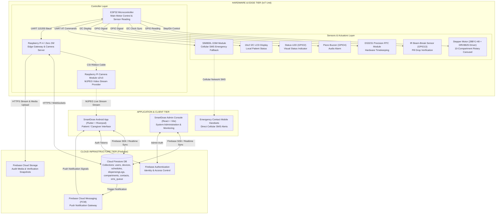

# 01. System Architecture Diagram — SmartDose

## Description
This diagram illustrates the multi-tier architecture of the SmartDose system, encompassing the **Hardware/Edge Tier** (ESP32 MCU, Raspberry Pi, Sensors, Motors, GSM), **Cloud Tier** (Firebase Auth, Cloud Firestore, FCM, Cloud Storage), and **Application Tier** (Flutter Mobile App & React Admin Web Console).

---

## 📋 Mermaid Code for Draw.io Import

