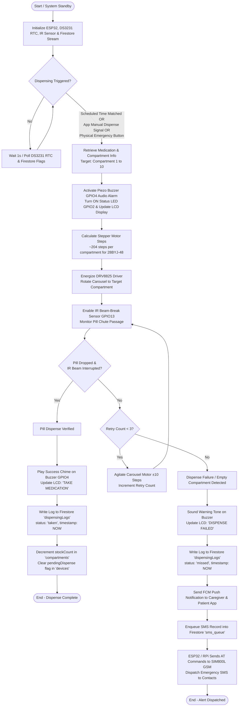

# 02. Dispensing Flowchart — SmartDose

## Description
This flowchart depicts the end-to-end execution flow of the medication dispensing process in the SmartDose system, including RTC schedule matching, stepper motor control, IR beam-break pill verification, retry mechanism, and multi-channel failure fallback (FCM & SIM800L GSM).

---

## 📋 Mermaid Code for Draw.io Import

