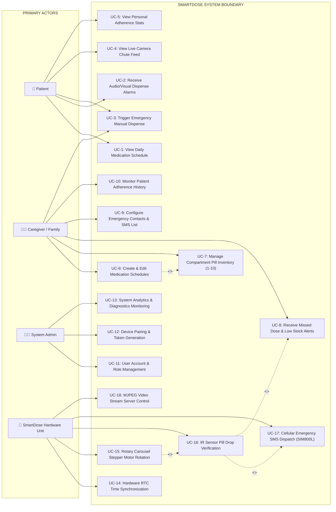

# 03. Use Case Diagram — SmartDose

## Description
This Use Case Diagram illustrates the system boundaries, primary actors (**Patient**, **Caregiver**, **System Administrator**, and **Hardware Unit**), and key system interactions within SmartDose.

---

## 📋 Mermaid Code for Draw.io Import

