# 04. Entity Relationship Diagram (ERD) — SmartDose

## Description
This ER Diagram details the document schema and relationships across Cloud Firestore collections (`users`, `devices`, `schedules`, `dispensingLogs`, `compartments`, `contacts`, `emergencyRequests`, `sms_queue`, `pairingTokens`).

---

## 📋 Mermaid Code for Draw.io Import

```mermaid
erDiagram
    USERS ||--o| DEVICES : "owns / paired to"
    USERS ||--o{ SCHEDULES : "has scheduled doses"
    USERS ||--o{ COMPARTMENTS : "manages inventory"
    USERS ||--o{ DISPENSING_LOGS : "generates logs"
    USERS ||--o{ CONTACTS : "configures contacts"
    USERS ||--o{ EMERGENCY_REQUESTS : "initiates"
    USERS ||--o{ SMS_QUEUE : "triggers SMS"
    DEVICES ||--o{ DISPENSING_LOGS : "executes dispense"
    DEVICES ||--o| PAIRING_TOKENS : "uses token for pairing"

    USERS {
        string uid PK "Unique User Identifier"
        string email "User Email Address"
        string name "Full Name"
        string role "Role: patient | caregiver | admin"
        string phone "Phone Number"
        string deviceId FK "Assigned Hardware Device ID (e.g. SD-0119)"
        string photoUrl "Profile Image URI / Base64"
        timestamp createdAt "Registration Timestamp"
    }

    DEVICES {
        string deviceId PK "Hardware Serial Number (e.g. SD-0119)"
        string status "Device Status: online | offline"
        string fwVersion "ESP32 Firmware Version"
        timestamp lastHeartbeat "Last Edge Pulse Time"
        boolean emergencyDispense "Emergency Dispense Active Flag"
        timestamp emergencyRequestedAt "Emergency Request Time"
        string emergencyRequestedBy "UID of Requester"
        map pendingDispense "Current Pending Remote Dispense Data"
    }

    COMPARTMENTS {
        string compartmentId PK "Document ID"
        string patientUid FK "Patient User ID"
        int compartmentNumber "Compartment Index (1 to 10)"
        string medicationName "Medication Name"
        string dosage "Dosage Description (e.g. 500mg)"
        int stockCount "Remaining Pill Count"
        int pillCapacity "Maximum Pill Capacity (e.g. 30)"
        timestamp lastRefilled "Last Refill Timestamp"
    }

    SCHEDULES {
        string scheduleId PK "Document ID"
        string patientUid FK "Patient User ID"
        int compartmentNumber "Assigned Compartment (1-10)"
        string medicationName "Medication Name"
        string dosage "Dosage String"
        timestamp scheduledTime "Time of Day / Scheduled Timestamp"
        string frequency "Frequency: Daily | Weekly | As Needed"
        boolean isActive "Schedule Enabled Flag"
        timestamp createdAt "Creation Timestamp"
    }

    DISPENSING_LOGS {
        string logId PK "Document ID"
        string patientUid FK "Patient User ID"
        string deviceId FK "Hardware Device ID"
        int compartmentNumber "Dispensed Compartment (1-10)"
        string medicationName "Medication Name"
        string status "Result Status: taken | missed | emergency"
        timestamp timestamp "Dispense Event Timestamp"
        timestamp createdAt "Record Creation Timestamp"
    }

    CONTACTS {
        string contactId PK "Document ID"
        string patientUid FK "Patient User ID"
        string name "Contact Name"
        string phone "Cellular Phone Number (+63...)"
        string relationship "Relationship: Family | Doctor | Caregiver"
        boolean isPrimary "Primary Notification Contact Flag"
    }

    EMERGENCY_REQUESTS {
        string requestId PK "Document ID"
        string patientUid FK "Patient User ID"
        string initiatedBy "Initiator: patient | caregiver"
        string status "Request Status: pending | executed | cancelled"
        timestamp requestedAt "Request Timestamp"
    }

    SMS_QUEUE {
        string queueId PK "Document ID"
        string patientUid FK "Patient User ID"
        string to "Recipient Phone Number"
        string contactName "Recipient Name"
        string message "SMS Payload Text"
        string status "Queue Status: pending | sent | failed"
        string triggeredBy "Trigger Reason: emergency | missed_dose"
        timestamp createdAt "Queue Timestamp"
    }

    PAIRING_TOKENS {
        string tokenId PK "Document ID"
        string deviceId FK "Target Device ID"
        string token "6-Digit Pairing Code"
        timestamp expiresAt "Token Expiration Time"
        boolean isUsed "Token Redemption Status"
    }
```

