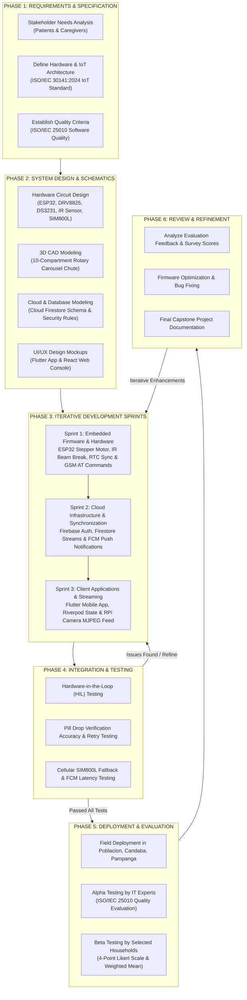

# 07. Agile Methodology Diagram — SmartDose

## Description
This diagram maps out the 6-Phase Agile Development Lifecycle utilized in creating the SmartDose system, aligned with **ISO/IEC 30141:2024** (IoT Reference Architecture) and **ISO/IEC 25010** (System and Software Quality Model) evaluation standards.

---

## 📋 Mermaid Code for Draw.io Import

