# 08. Input-Process-Output (IPO) Model — SmartDose

## Description
This IPO Diagram delineates the system inputs, internal hardware/cloud processing stages, and final physical/digital outputs of the SmartDose IoT system.

---

## 📋 Mermaid Code for Draw.io Import

```mermaid
graph LR
    subgraph Inputs ["INPUT STAGE"]
        direction TB
        subgraph Input_Sensors ["Sensors & Hardware Signals"]
            I1["DS3231 RTC Clock Timestamp"]
            I2["IR Beam-Break Sensor Signal (GPIO13)"]
            I3["Physical Emergency Push Button"]
            I4["Raspberry Pi Camera Module Video Lens"]
        end

        subgraph Input_User ["User & App Inputs"]
            I5["Medication Schedule (Time, Dosage, Freq)"]
            I6["Compartment Stock Count & Refill Level"]
            I7["Remote Dispense Command from App"]
            I8["Emergency Alert Contacts & Phone Numbers"]
        end
    end

    subgraph Process ["PROCESS STAGE"]
        direction TB
        P1["1. Time Comparison Algorithm<br/>(DS3231 RTC vs Scheduled Time)"]
        P2["2. Stepper Motor Position Logic<br/>(DRV8825 ~204 steps per compartment)"]
        P3["3. IR Pill Passage Detection & Retry Logic<br/>(Up to 3 retries with carousel agitation)"]
        P4["4. Real-Time Cloud Synchronization<br/>(Cloud Firestore Database Updates)"]
        P5["5. Multi-Channel Alert Router<br/>(FCM Push & SIM800L Cellular SMS Engine)"]
        P6["6. MJPEG Video Encoding & Stream Gateway"]
    end

    subgraph Outputs ["OUTPUT STAGE"]
        direction TB
        subgraph Output_Physical ["Physical & Local Hardware Outputs"]
            O1["Rotated Compartment & Dispensed Pill"]
            O2["Audio Alarm Tone (Piezo Buzzer GPIO4)"]
            O3["Status LED Indicator (GPIO2)"]
            O4["16x2 I2C LCD Status Display"]
        end

        subgraph Output_Digital ["Digital & Client Outputs"]
            O5["Cloud Log Entry (status: taken / missed)"]
            O6["Updated Stock Count in Firestore"]
            O7["FCM Push Notifications to Smartphone"]
            O8["Emergency Cellular SMS to Contacts (SIM800L)"]
            O9["Live MJPEG Camera Feed on Mobile App"]
        end
    end

    Input_Sensors --> Process
    Input_User --> Process
    Process --> Output_Physical
    Process --> Output_Digital
```

