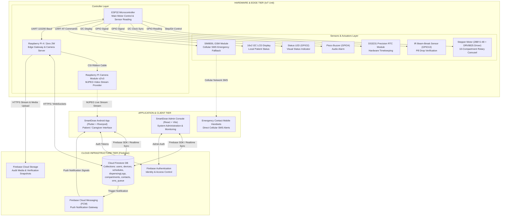
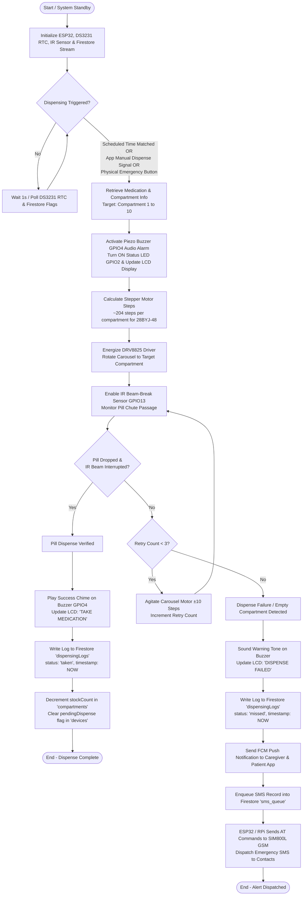
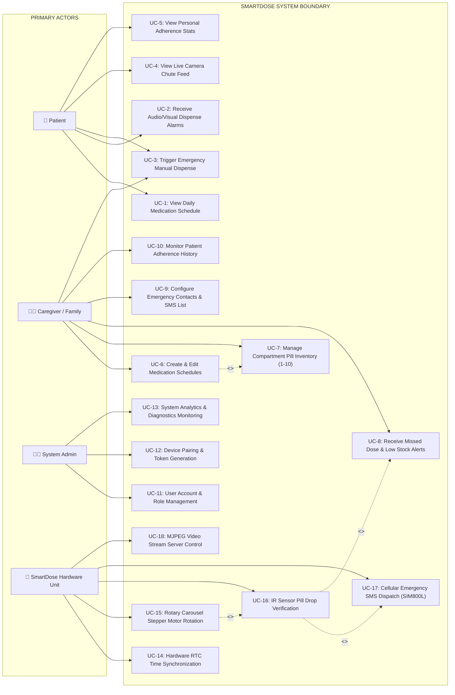
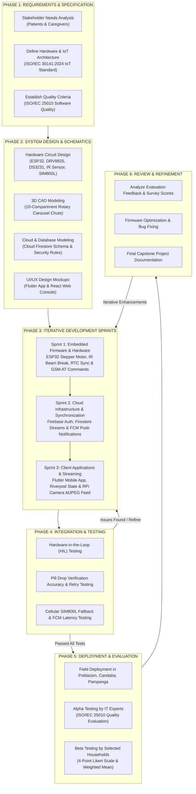

# Master Diagram Document — SmartDose System

This document contains all 9 Mermaid diagrams for the **SmartDose IoT Smart Pill Dispenser** project.  
You can import any of these diagrams directly into **[draw.io](https://app.diagrams.net)** via **Arrange > Insert > Advanced > Mermaid...** (or **Extras > Edit Diagram...**).

---

## Index of Diagrams
1. [01. System Architecture Diagram](#01-system-architecture-diagram)
2. [02. Dispensing Flowchart](#02-dispensing-flowchart)
3. [03. Use Case Diagram](#03-use-case-diagram)
4. [04. Entity Relationship Diagram (ERD)](#04-entity-relationship-diagram-erd)
5. [05. Level 0 Data Flow Diagram (Context Diagram)](#05-level-0-data-flow-diagram-context-diagram)
6. [06. Level 1 Data Flow Diagram](#06-level-1-data-flow-diagram)
7. [07. Agile Methodology Diagram](#07-agile-methodology-diagram)
8. [08. Input-Process-Output (IPO) Model](#08-input-process-output-ipo-model)
9. [09. Mobile App Flowchart](#09-mobile-app-flowchart)

---

## 01. System Architecture Diagram



---

## 02. Dispensing Flowchart



---

## 03. Use Case Diagram



---

## 04. Entity Relationship Diagram (ERD)

```mermaid
erDiagram
    USERS ||--o| DEVICES : "owns / paired to"
    USERS ||--o{ SCHEDULES : "has scheduled doses"
    USERS ||--o{ COMPARTMENTS : "manages inventory"
    USERS ||--o{ DISPENSING_LOGS : "generates logs"
    USERS ||--o{ CONTACTS : "configures contacts"
    USERS ||--o{ EMERGENCY_REQUESTS : "initiates"
    USERS ||--o{ SMS_QUEUE : "triggers SMS"
    DEVICES ||--o{ DISPENSING_LOGS : "executes dispense"
    DEVICES ||--o| PAIRING_TOKENS : "uses token for pairing"

    USERS {
        string uid PK "Unique User Identifier"
        string email "User Email Address"
        string name "Full Name"
        string role "Role: patient | caregiver | admin"
        string phone "Phone Number"
        string deviceId FK "Assigned Hardware Device ID (e.g. SD-0119)"
        string photoUrl "Profile Image URI / Base64"
        timestamp createdAt "Registration Timestamp"
    }

    DEVICES {
        string deviceId PK "Hardware Serial Number (e.g. SD-0119)"
        string status "Device Status: online | offline"
        string fwVersion "ESP32 Firmware Version"
        timestamp lastHeartbeat "Last Edge Pulse Time"
        boolean emergencyDispense "Emergency Dispense Active Flag"
        timestamp emergencyRequestedAt "Emergency Request Time"
        string emergencyRequestedBy "UID of Requester"
        map pendingDispense "Current Pending Remote Dispense Data"
    }

    COMPARTMENTS {
        string compartmentId PK "Document ID"
        string patientUid FK "Patient User ID"
        int compartmentNumber "Compartment Index (1 to 10)"
        string medicationName "Medication Name"
        string dosage "Dosage Description (e.g. 500mg)"
        int stockCount "Remaining Pill Count"
        int pillCapacity "Maximum Pill Capacity (e.g. 30)"
        timestamp lastRefilled "Last Refill Timestamp"
    }

    SCHEDULES {
        string scheduleId PK "Document ID"
        string patientUid FK "Patient User ID"
        int compartmentNumber "Assigned Compartment (1-10)"
        string medicationName "Medication Name"
        string dosage "Dosage String"
        timestamp scheduledTime "Time of Day / Scheduled Timestamp"
        string frequency "Frequency: Daily | Weekly | As Needed"
        boolean isActive "Schedule Enabled Flag"
        timestamp createdAt "Creation Timestamp"
    }

    DISPENSING_LOGS {
        string logId PK "Document ID"
        string patientUid FK "Patient User ID"
        string deviceId FK "Hardware Device ID"
        int compartmentNumber "Dispensed Compartment (1-10)"
        string medicationName "Medication Name"
        string status "Result Status: taken | missed | emergency"
        timestamp timestamp "Dispense Event Timestamp"
        timestamp createdAt "Record Creation Timestamp"
    }

    CONTACTS {
        string contactId PK "Document ID"
        string patientUid FK "Patient User ID"
        string name "Contact Name"
        string phone "Cellular Phone Number (+63...)"
        string relationship "Relationship: Family | Doctor | Caregiver"
        boolean isPrimary "Primary Notification Contact Flag"
    }

    EMERGENCY_REQUESTS {
        string requestId PK "Document ID"
        string patientUid FK "Patient User ID"
        string initiatedBy "Initiator: patient | caregiver"
        string status "Request Status: pending | executed | cancelled"
        timestamp requestedAt "Request Timestamp"
    }

    SMS_QUEUE {
        string queueId PK "Document ID"
        string patientUid FK "Patient User ID"
        string to "Recipient Phone Number"
        string contactName "Recipient Name"
        string message "SMS Payload Text"
        string status "Queue Status: pending | sent | failed"
        string triggeredBy "Trigger Reason: emergency | missed_dose"
        timestamp createdAt "Queue Timestamp"
    }

    PAIRING_TOKENS {
        string tokenId PK "Document ID"
        string deviceId FK "Target Device ID"
        string token "6-Digit Pairing Code"
        timestamp expiresAt "Token Expiration Time"
        boolean isUsed "Token Redemption Status"
    }
```



---

## 05. Level 0 Data Flow Diagram (Context Diagram)

```mermaid
graph TD
    subgraph External_Entities ["EXTERNAL ENTITIES"]
        PATIENT_CAREGIVER["👤/👩‍⚕️ Patient & Caregiver<br/>(Flutter App User)"]
        ADMIN["👨‍💼 System Administrator<br/>(React Web Console User)"]
        EMERGENCY_CONTACTS["📱 Emergency Contacts<br/>(Cellular Mobile Phone Users)"]
        FIREBASE_CLOUD["☁️ Firebase Cloud Infrastructure<br/>(Auth, Firestore, FCM, Storage)"]
    end

    subgraph System_Process ["CENTRAL PROCESS 0"]
        P0(("0.0<br/>SMARTDOSE IoT SYSTEM<br/>(ESP32 MCU + RPi Edge + Cloud Platform)"))
    end

    %% Data Flows to/from Patient & Caregiver
    PATIENT_CAREGIVER -->|Schedule Config, Refill Data, Remote Dispense, Emergency Trigger| P0
    P0 -->|FCM Notifications, Live MJPEG Video Stream, Adherence Logs, Low-Stock Alerts| PATIENT_CAREGIVER

    %% Data Flows to/from Admin
    ADMIN -->|Admin Auth Credentials, User Management, Device Pairing Commands| P0
    P0 -->|System Diagnostics, Telemetry Heartbeats, Global Analytics & Audit Logs| ADMIN

    %% Data Flows to Emergency Contacts
    P0 -->|Cellular GSM SMS Emergency Alerts (SIM800L)| EMERGENCY_CONTACTS

    %% Data Flows to/from Firebase Cloud
    P0 <-->|Real-time Database Sync, Auth Verification, Push Notifications & Storage Uploads| FIREBASE_CLOUD
```

---

## 06. Level 1 Data Flow Diagram

```mermaid
graph TB
    subgraph External_Entities ["EXTERNAL ENTITIES"]
        PATIENT["👤 Patient / Caregiver"]
        ADMIN["👨‍💼 System Admin"]
        CONTACTS["📱 Emergency Contacts"]
    end

    subgraph Data_Stores ["DATA STORES (Firestore)"]
        D1[("D1: Users & Devices Store")]
        D2[("D2: Schedules & Compartment Inventory")]
        D3[("D3: Dispensing Logs & Audit Trail")]
        D4[("D4: Emergency Contacts & SMS Queue")]
    end

    subgraph Processes ["SUB-PROCESSES"]
        P1(("1.0<br/>User Auth & Device Pairing"))
        P2(("2.0<br/>Schedule & Inventory Mgmt"))
        P3(("3.0<br/>RTC & Carousel Stepper Control"))
        P4(("4.0<br/>IR Sensor Verification"))
        P5(("5.0<br/>Alerting & GSM/FCM Gateway"))
        P6(("6.0<br/>Live Camera Streaming"))
    end

    %% Process 1.0 Flows
    PATIENT -->|Login / Pair Request| P1
    ADMIN -->|Pairing Token / Role Config| P1
    P1 <-->|Read / Write Profile & Device ID| D1
    P1 -->|Auth Token & Session Status| PATIENT

    %% Process 2.0 Flows
    PATIENT -->|Set Schedule & Refill Compartments| P2
    P2 <-->|Read / Write Schedules & Stock| D2
    P2 -->|Schedule Summary & Low-Stock Warning| PATIENT

    %% Process 3.0 Flows
    D2 -->|Fetch Active Schedules| P3
    P3 -->|Compare Time (DS3231 RTC)| P3
    P3 -->|Step Signals (DRV8825 + 28BYJ-48)| P4

    %% Process 4.0 Flows
    P4 -->|IR Sensor Drop Signal (GPIO13)| P4
    P4 -->|Write Log (taken / missed)| D3
    P4 -->|Decrement Stock Count| D2
    P4 -->|Dispense Result / Status| P5

    %% Process 5.0 Flows
    D4 -->|Fetch Emergency Phone Numbers| P5
    P5 -->|Enqueue SMS Record| D4
    P5 -->|Send AT Commands to SIM800L| CONTACTS
    P5 -->|FCM Push Notification| PATIENT

    %% Process 6.0 Flows
    PATIENT -->|Request Video Feed| P6
    P6 -->|MJPEG Live Video Stream| PATIENT
```

---

## 07. Agile Methodology Diagram



---

## 08. Input-Process-Output (IPO) Model

```mermaid
graph LR
    subgraph Inputs ["INPUT STAGE"]
        direction TB
        subgraph Input_Sensors ["Sensors & Hardware Signals"]
            I1["DS3231 RTC Clock Timestamp"]
            I2["IR Beam-Break Sensor Signal (GPIO13)"]
            I3["Physical Emergency Push Button"]
            I4["Raspberry Pi Camera Module Video Lens"]
        end

        subgraph Input_User ["User & App Inputs"]
            I5["Medication Schedule (Time, Dosage, Freq)"]
            I6["Compartment Stock Count & Refill Level"]
            I7["Remote Dispense Command from App"]
            I8["Emergency Alert Contacts & Phone Numbers"]
        end
    end

    subgraph Process ["PROCESS STAGE"]
        direction TB
        P1["1. Time Comparison Algorithm<br/>(DS3231 RTC vs Scheduled Time)"]
        P2["2. Stepper Motor Position Logic<br/>(DRV8825 ~204 steps per compartment)"]
        P3["3. IR Pill Passage Detection & Retry Logic<br/>(Up to 3 retries with carousel agitation)"]
        P4["4. Real-Time Cloud Synchronization<br/>(Cloud Firestore Database Updates)"]
        P5["5. Multi-Channel Alert Router<br/>(FCM Push & SIM800L Cellular SMS Engine)"]
        P6["6. MJPEG Video Encoding & Stream Gateway"]
    end

    subgraph Outputs ["OUTPUT STAGE"]
        direction TB
        subgraph Output_Physical ["Physical & Local Hardware Outputs"]
            O1["Rotated Compartment & Dispensed Pill"]
            O2["Audio Alarm Tone (Piezo Buzzer GPIO4)"]
            O3["Status LED Indicator (GPIO2)"]
            O4["16x2 I2C LCD Status Display"]
        end

        subgraph Output_Digital ["Digital & Client Outputs"]
            O5["Cloud Log Entry (status: taken / missed)"]
            O6["Updated Stock Count in Firestore"]
            O7["FCM Push Notifications to Smartphone"]
            O8["Emergency Cellular SMS to Contacts (SIM800L)"]
            O9["Live MJPEG Camera Feed on Mobile App"]
        end
    end

    Input_Sensors --> Process
    Input_User --> Process
    Process --> Output_Physical
    Process --> Output_Digital
```



---

## 09. Mobile App Flowchart

```mermaid
flowchart TD
    START([App Launch]) --> AUTH_CHECK{Authenticated &<br/>Device Paired?}
    
    AUTH_CHECK -->|First Launch| ONBOARDING[Onboarding Screen<br/>3 Splash Slides & Introduction]
    ONBOARDING --> LOGIN[Login Screen<br/>Email/Password, Google & Facebook Sign-In]
    
    AUTH_CHECK -->|Not Logged In| LOGIN
    
    LOGIN -->|New User| REGISTER[Register Screen<br/>Create Account & Select Role: Patient / Caregiver]
    LOGIN -->|Forgot Password| FORGOT_PWD[Forgot Password Screen<br/>Email Password Reset Link]
    FORGOT_PWD --> LOGIN
    REGISTER --> PAIR_DEVICE{Paired Device<br/>Assigned?}

    LOGIN -->|Success| PAIR_DEVICE
    
    PAIR_DEVICE -->|No Device Paired| PAIRING_SCREEN[Device Pairing Screen<br/>Enter 6-Digit Pairing Code / Scan QR Code]
    PAIRING_SCREEN -->|Valid Code e.g. SD-0119| DASHBOARD
    
    PAIR_DEVICE -->|Device Paired| DASHBOARD[Main Patient / Caregiver Dashboard Shell<br/>Bottom Navigation Bar]

    %% Bottom Navigation Tabs
    DASHBOARD --> TAB1[1. Home Tab]
    DASHBOARD --> TAB2[2. Medications Tab]
    DASHBOARD --> TAB3[3. History Log Tab]
    DASHBOARD --> TAB4[4. Alerts & Notifications Tab]
    DASHBOARD --> TAB5[5. Profile & Settings Tab]

    %% Tab 1: Home Tab Actions
    TAB1 --> HOME_NEXT[Next Medication Countdown Card]
    HOME_NEXT --> DISPENSE_NOW[Click 'Dispense Now'<br/>Send Signal to Firestore 'devices']
    TAB1 --> HOME_RING[Daily Adherence Ring & Progress Breakdown]
    TAB1 --> HOME_QUICK[Quick Actions]
    
    HOME_QUICK --> QA_CAM[Live Camera Stream<br/>MJPEG Video Feed]
    HOME_QUICK --> QA_CONTACTS[Emergency Contacts<br/>Call & Manage SMS List]
    HOME_QUICK --> QA_INV[Compartment Inventory<br/>10-Compartment Pill Levels]
    HOME_QUICK --> QA_DEVICE[Device Connected Screen<br/>Wi-Fi Status, Battery & SD-0119 Firmware]
    
    TAB1 --> HOME_EMERGENCY[Emergency Dispense Button]
    HOME_EMERGENCY --> TRIG_EMERGENCY[Dispatch Emergency Signal to Device &<br/>Enqueue SMS to Contacts via SIM800L]

    %% Tab 2: Medications Tab Actions
    TAB2 --> MED_LIST[View Active Medication Schedules]
    TAB2 --> ADD_MED[Click 'Add Medication']
    ADD_MED --> MED_FORM[Select Compartment 1-10, Name,<br/>Dosage, Time & Frequency]
    MED_FORM --> SAVE_SCHED[Save to Firestore 'schedules']
    MED_LIST --> REFILL_MED[Refill Compartment Pills]

    %% Tab 3: History Log Tab
    TAB3 --> LOG_FILTER[Filter Logs: All | Taken | Missed | Emergency]
    LOG_FILTER --> LOG_DETAILS[View Event Timestamps & Compartment Audit]

    %% Tab 4: Alerts Tab
    TAB4 --> ALERTS_LIST[View FCM Notifications & Low-Stock Alerts]
    ALERTS_LIST --> MARK_READ[Mark as Read / Clear All]

    %% Tab 5: Profile Tab
    TAB5 --> EDIT_PROFILE[Edit User Profile & Avatar Gradient]
    TAB5 --> VIEW_DEVICE[View Paired Device Details SD-0119]
    TAB5 --> TOGGLE_THEME[Toggle Dark / Light Theme Mode]
    TAB5 --> SIGNOUT[Sign Out]
    SIGNOUT --> LOGIN
```
